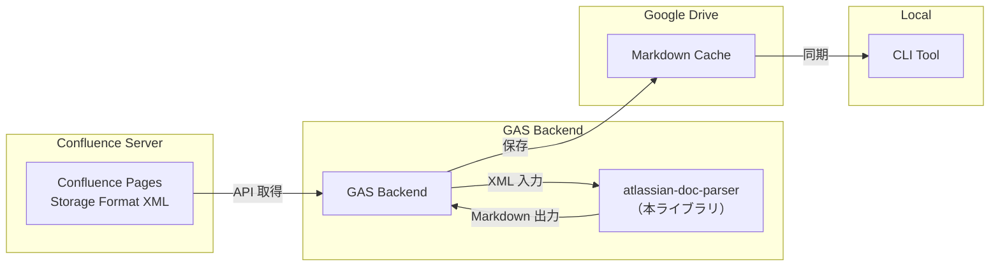
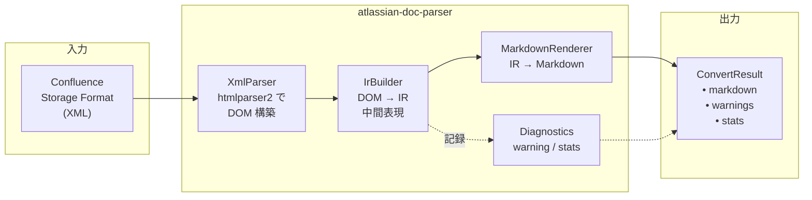

## ライブラリ概要

atlassian-doc-parser は、Confluence Storage Format（XML ベースの独自形式）を Markdown に変換する ReScript ライブラリです。Confluence Local Sync プロジェクトの変換エンジンとして、GAS Backend から npm パッケージとして利用されます。

## Confluence Local Sync における位置づけ

GAS Backend が Confluence API から取得した Storage Format XML を本ライブラリに渡し、変換結果の Markdown を Google Drive に保存します。CLI Tool はこの Markdown をローカルに同期し、AI エージェントが既存の MCP ツール経由で参照します。

## 技術スタック

| 項目 | 技術 |
|------|------|
| 言語 | ReScript |
| XML パース | htmlparser2 |
| テスト | ReScript Test（fixture ベース + Unit） |
| パッケージ運用 | `0.x` 系、初期は `file:` ローカル参照 |

## 変換の流れ

本ライブラリは XML → IR → Markdown の 2 段階変換アーキテクチャを採用しています。

1. **XmlParser** — htmlparser2 で XML 文字列を DOM ツリーに変換
2. **IrBuilder** — DOM ツリーを再帰的に走査し、Markdown に近い中間表現（IR）を構築
3. **MarkdownRenderer** — IR を Markdown 文字列に変換（純粋関数）
4. **Diagnostics** — 変換中の warning メッセージと統計情報を収集

## ドキュメント構成

- [01. 背景と方針](./01_background/) - なぜ Confluence 専用パーサーを自作するのか
- [02. 設計](./02_design/) - アーキテクチャと主要な設計判断
